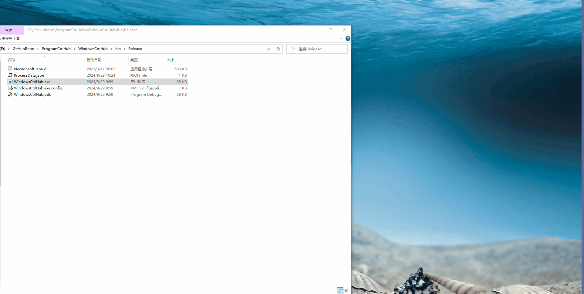
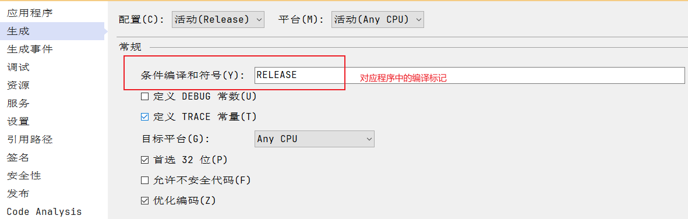
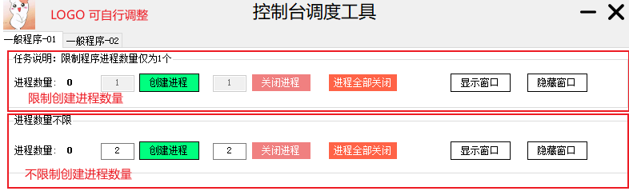
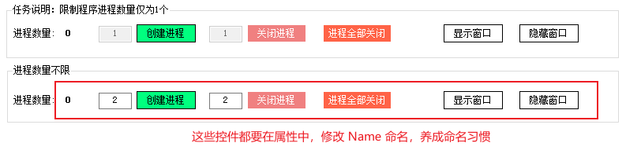

# ProgramCtrlHub
1. Windows Server 多程序控制工具
2. 用于控制多个应用程序执行，每个程序仅需一份可执行文件。按照设定的数量创建或关闭多个程序进程
3. 目前专门为控制台程序创建的界面，可根据实际需要自行调整


# 运行环境

1. Windows Server 2012
2. .NET Framework 4.7.2


# 操作说明





## 程序数量控制

- **创建进程**：输入数量 X，点击改按钮可创建 X 个进程。重复点击可创建多次
- **关闭进程**：输入数量 Y，点击改按钮可关闭 Y 个进程。重复点击可关闭多次，建议让 X = Y
- **进程全部关闭**：将目前还在运行的程序，全部关闭。
- **初始化创建进程**：将按照创建进程左侧的输入数量，全部创建进程。等同于手动挨个点击创建进程按钮，一般在该工具启动后点击。
- **进程全部关闭**：将后台的进程全部关闭。一般在该工具退出前点击。*如果全部关闭失败，先依次点击进程关闭按钮，剩余无法关闭的，请手动杀死后台进程，命名为：程序名_8位随机字符*


## 控制显示和隐藏

1. 仅针对控制台程序，如果是其他类型的程序，请自行完善流程
2. 显示时可以查询输出内容，隐藏到后台只是为了不占用工具栏空间


# 自定义流程

1. 创建要被执行的项目
2. Hub 关联上该项目，创建相关配置信息


## 被执行项目

1. 需要引用 Common.Lib 项目，或者将Common.Lib 的内容迁移至您的类库项目中引用

2. 配置 RELEASE 环境

   

3. 设置填写隐藏配置

   ```c#
   namespace A1
   {
       internal class Program
       {
           static void Main(string[] args)
           {
   #if RELEASE
               // 正式环境，隐藏程序到后台运行
               ConsoleCtrl.ConsoleHide(args, "A1");
   #endif
       		// 程序主逻辑...
               Console.ReadKey();
           }
       }
   }
   ```


## Hub 关联应用


### 基础配置

1. App.Config 设置本地运行路径，和线上执行位置

   ```xml
   <appSettings>
   	<!--Debug 本地开发程序根目录-->
   	<add key="debug.A1.exe.path" value="E:GitHubRepo\ProgramCtrlHub\A1\bin\Debug\A1.exe"/>	
   	<!--Release 线上存储位置-->
   	<add key="A1.exe.path" value="E:GitHubRepo\ProgramCtrlHub\A1\bin\Release\A1.exe"/>	
   </appSettings>
   ```

2. ProcessData.cs 设置进程名相关内容

   ```c#
   public class ProcessData
   {
       public ProcessData()
       {
           Processes_A1 = new List<Process>();
       }
   
       public const string ProcessName_A1 = "A1";
       public List<Process> Processes_A1 { get; set; }
   }
   ```


### 扩充窗体页面内容

1. 按照实际需要，限制只运行一个程序的，复制第一个模块。不限制运行数量的复制第二个模块。如果程序数量过多，可以新增选项卡，按照实际业务划分多个模块

   

2. 调整说明，修改控件名称，建议用关联的程序名进行修改

   

### 补充代码逻辑

#### 完成模块功能

1. 依次点击按钮 `创建进程`、`关闭进程`、`进程全部关闭`、`显示窗口`、`隐藏窗口`，创建按钮点击事件

2. 使用 `#region` 标记，将自动生成的5个事件包含起来

3. 参照以前的代码，完成代码功能，只需修改成指定的控件名即可，限定数量的参照 A1 代码，不限制数量的参照 A2 代码

   ```c#
   #region A1
   
   private void btn_A1_create_Click(object sender, EventArgs e)
   {
       if (processData.Processes_A1.Count >= 1)
       {
           MessageBox.Show("最多只能创建一个进程", "A1");
           return;
       }
       var createCount = Convert.ToInt32(input_A1_create_count.Text);
       if (createCount == 0)
       {
           MessageBox.Show("请输入创建进程的数量", "A1");
       }
       else
       {
           string exePath = AppConfigValue.Get($"{ProcessData.ProcessName_A1}.exe.path");
           processKit.MultiProcessCreate(processData.Processes_A1, createCount, ProcessData.ProcessName_A1, exePath);
           Lbl_A1_count.Text = processData.Processes_A1.Count.ToString();
       }
   }
   
   private void btn_A1_close_Click(object sender, EventArgs e)
   {
       var closeCount = Convert.ToInt32(input_A1_close_count.Text);
       if (closeCount == 0)
       {
           MessageBox.Show("请输入关闭进程的数量", "生产者");
       }
       else
       {
           processKit.MultiProcessClose(processData.Processes_A1, closeCount);
           Lbl_A1_count.Text = processData.Processes_A1.Count.ToString();
       }
   }
   
   private void btn_A1_close_all_Click(object sender, EventArgs e)
   {
       processKit.MultiProcessClose(processData.Processes_A1, processData.Processes_A1.Count);
       Lbl_A1_count.Text = processData.Processes_A1.Count.ToString();
   }
   
   private void btn_A1_show_Click(object sender, EventArgs e)
   {
       processKit.ProcessShowALL(processData.Processes_A1);
   }
   
   private void btn_A1_hidden_Click(object sender, EventArgs e)
   {
       processKit.ProcessHideALL(processData.Processes_A1);
   }
   
   
   #endregion
   ```


#### 补足公共代码逻辑

```c#
/// <summary>
/// 加载当前存在的进程
/// </summary>
private void LoadActiveProcess()
{
    // 【复制上边的进行修改】
    if (processNames.Contains(ProcessData.ProcessName_A3))
    {
        processData.Processes_A3 = processKit.GetProcessByName(ProcessData.ProcessName_A3, processDict[ProcessData.ProcessName_A3]);
        lbl_A3_count.Text = processData.Processes_A3.Count.ToString();
    }
}


/// <summary>
/// 保存进程名到本地
/// </summary>
private void SaveActiveProcessName()
{
    // 保存配置
    var processDict = new Dictionary<string, List<string>>();
    AddActiveProcessName(processDict, ProcessData.ProcessName_A1, processData.Processes_A1);
    AddActiveProcessName(processDict, ProcessData.ProcessName_A2, processData.Processes_A2);
    
    // 【复制上边的进行修改】
    AddActiveProcessName(processDict, ProcessData.ProcessName_A3, processData.Processes_A3);
    
    var processDataJson = JsonConvert.SerializeObject(processDict);
    FileKit.WriteText(GetBakFilePath(), processDataJson, false);
}


/// <summary>
/// 初始化开启进程
/// </summary>
private void btn_consume_init_create_all_Click(object sender, EventArgs e)
{
    // 检查是否存在进程，如果存在进程就不能进行初始化操作
    // 【补充 新的判断条件】
    if (processData.Processes_A1.Count > 0 ||
        processData.Processes_A2.Count > 0 ||
       processData.Processes_A3.Count > 0 ||)
    {
        MessageBox.Show("已经开启过线程，不能执行初始化操作", "初始化创建进程");
    }
    else
    {
        btn_A1_create_Click(btn_A1_create, new EventArgs());
        btn_A2_create_Click(btn_A2_create, new EventArgs());
    }
}


/// <summary>
/// 关闭全部进程
/// </summary>
private void btn_process_consume_close_all_Click(object sender, EventArgs e)
{
    btn_A1_close_all_Click(btn_A1_close_all, new EventArgs());
    btn_A2_close_all_Click(btn_A2_close_all, new EventArgs());
    
    // 【复制上边的进行修改】
    btn_A3_close_all_Click(btn_A3_close_all, new EventArgs());
}
```

